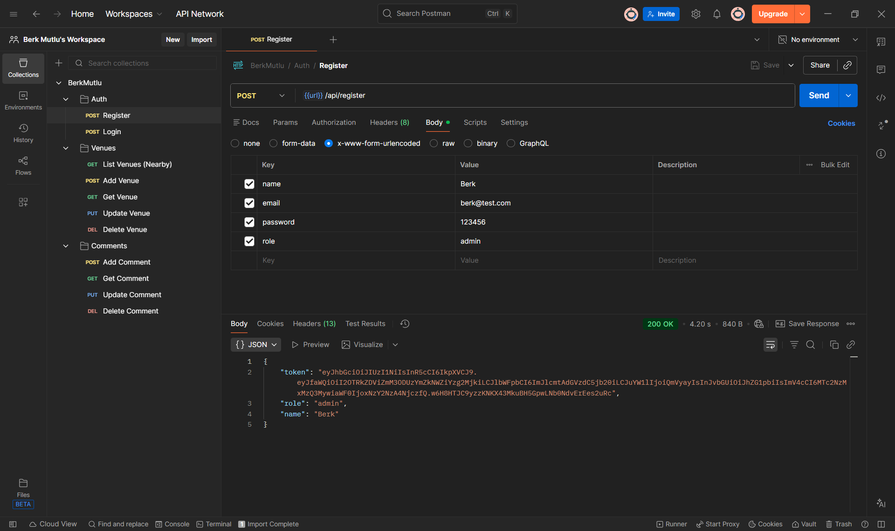
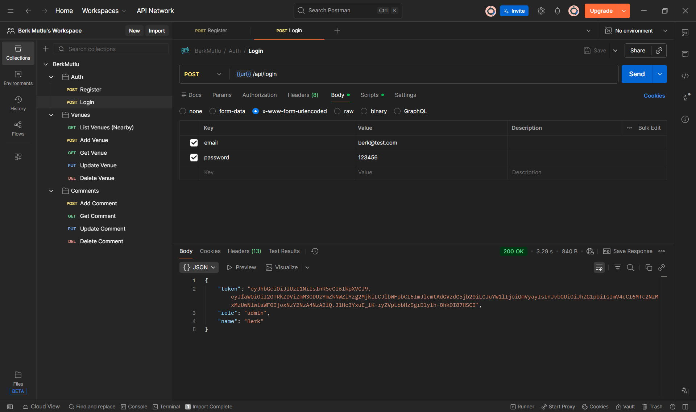
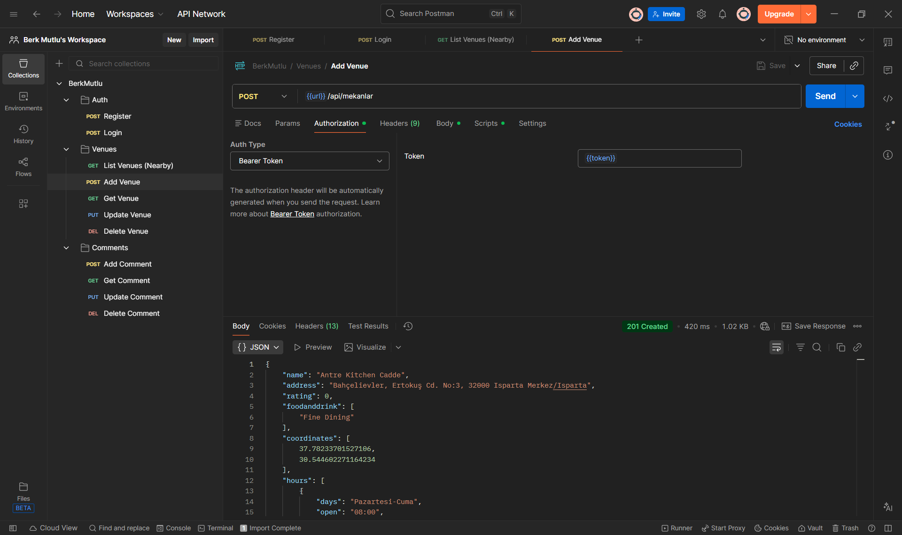
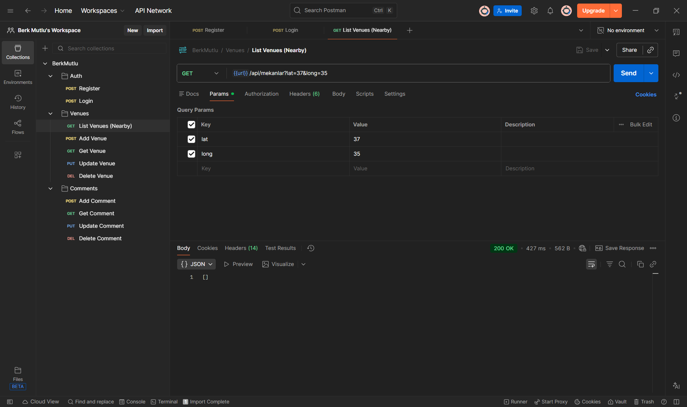
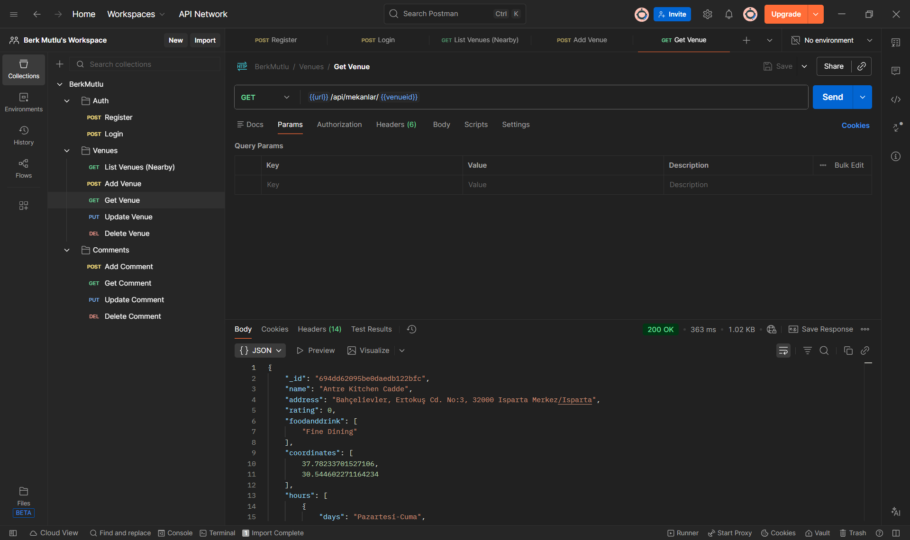
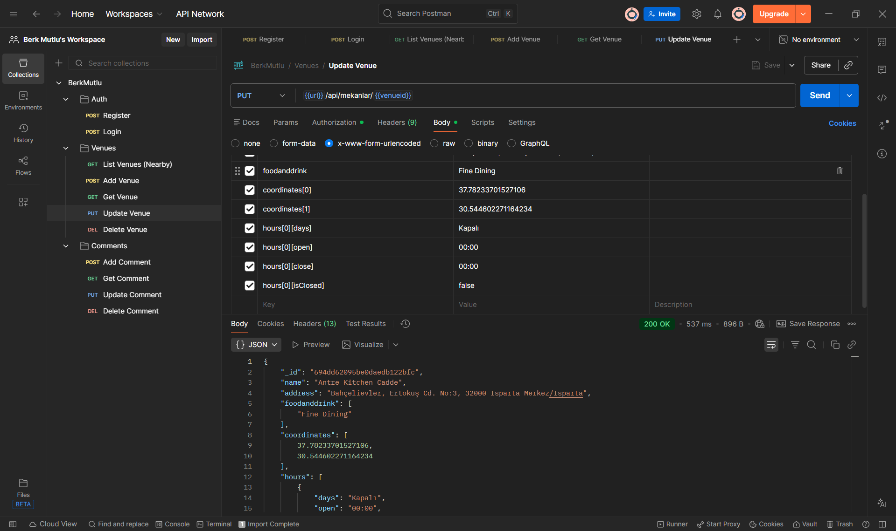
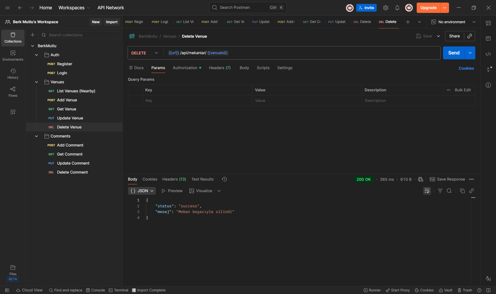
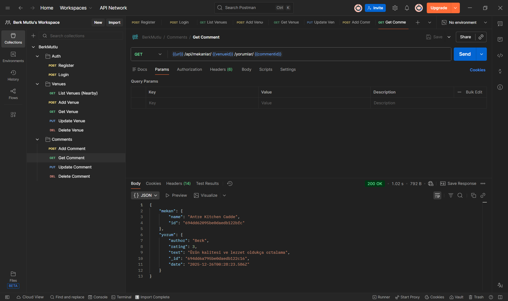
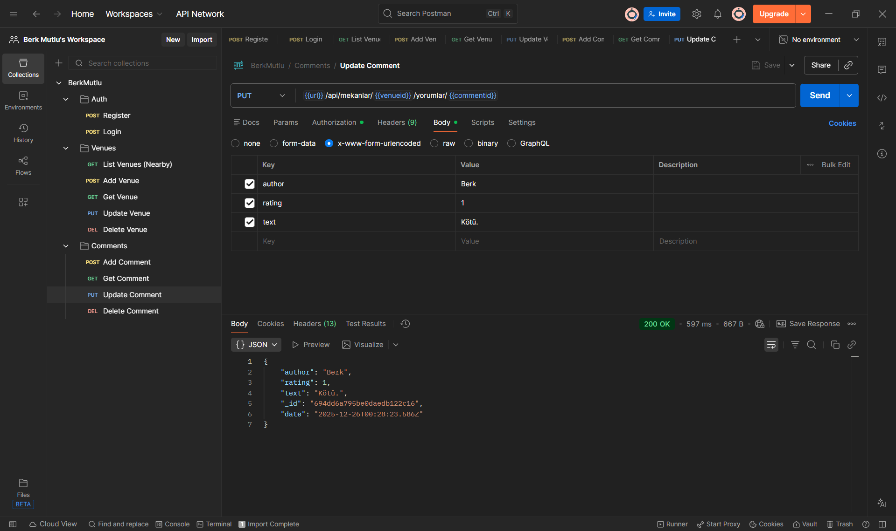
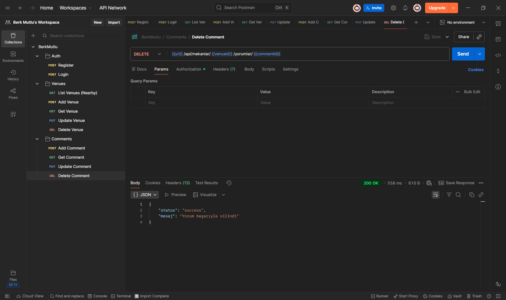

## 📌 Genel Bakış (Overview)

Venue API, konum tabanlı mekan keşfi, kullanıcı etkileşimi (yorumlar) ve güvenli kimlik doğrulama işlemleri için tasarlanmış modern bir backend çözümüdür. Bu servis sayesinde geliştiriciler, uygulamalarına hızlıca mekan listeleme, sosyal geri bildirim ve kullanıcı yönetim özellikleri entegre edebilirler.

🔗 **Site Linki :** [https://web-s7ma.vercel.app/](https://web-s7ma.vercel.app/)

## Kurulum 

Geliştirme ortamınızı hazırlamak için aşağıdaki komutları sırasıyla terminalinizde çalıştırın.

```sh
# 1. Projeyi yerelinize çekin
git clone <repository-url>

# 2. Proje klasörüne geçiş yapın
cd proje-klasoru

# 3. Gerekli paketleri yükleyin
npm install

# 4. Çevresel değişkeleri (.env) ayarlayın
# (Örnek: JWT_SECRET=gizliAnahtar, dbURI=mongodb+srv://...)

# 5. Uygulamayı başlatın
npm run start
```

## 📷 Fotoğraflar

#### Register



#### Login



#### AddVenue



#### List Nearby Venues



#### Get Venue



#### UpdateVenue



#### Delete Venue



#### AddComment


#### GetComment



#### UpdateComment



#### DeleteComment



---